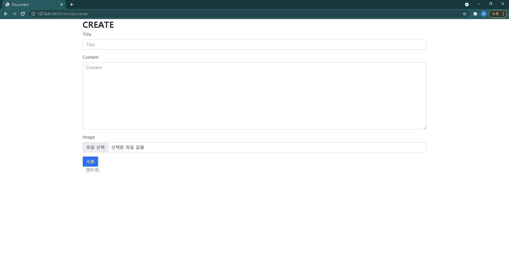

[TOC]


# 템플릿 외 코드

## 01) SETTINGS

<br>

```python
# crud/settings.py

# ...(생략)...

INSTALLED_APPS = [
    'articles', # == 'articles.apps.ArticlesConfig'
    'imagekit',
    'django_cleanup',
    'bootstrap5',
    # 'django_cleanup.apps.CleanupConfig', # == 'django_cleanup'
    
    'django.contrib.admin',
    'django.contrib.auth',
    'django.contrib.contenttypes',
    'django.contrib.sessions',
    'django.contrib.messages',
    'django.contrib.staticfiles',
]

# ...(생략)...

TEMPLATES = [
    {
        'BACKEND': 'django.template.backends.django.DjangoTemplates',
        'DIRS': [BASE_DIR / 'templates'],
        'APP_DIRS': True,
        'OPTIONS': {
            'context_processors': [
                'django.template.context_processors.debug',
                'django.template.context_processors.request',
                'django.contrib.auth.context_processors.auth',
                'django.contrib.messages.context_processors.messages',
            ],
        },
    },
]

# ...(생략)...

LANGUAGE_CODE = 'ko-kr'

TIME_ZONE = 'Asia/Seoul'

# ...(생략)...

STATIC_URL = '/static/'

STATICFILES_DIRS = [ BASE_DIR / 'static',]

MEDIA_ROOT = BASE_DIR / 'media'
# Media 파일을 저장할 폴더

MEDIA_URL = '/media/'
# Django는 성능을위해서 이미지를 DB에 저장하지 않고, 경로만 저장

# ...(생략)...
```

<br>


## 02) URLS

<br>

```python
# crud/urls.py

from django.contrib import admin
from django.urls import path, include

from django.conf import settings
from django.conf.urls.static import static

urlpatterns = [
    path('admin/', admin.site.urls),
    path('articles/', include('articles.urls')),
] + static(settings.MEDIA_URL, document_root=settings.MEDIA_ROOT)
```

-  settings.MEDIA_URL : media file public URL을 의미
-  document_root: 실제 해당 미디어 파일은 어디에 있는지

<br>

```python
# articles/urls.py

from django.urls import path
from . import views

app_name = "articles"
urlpatterns = [
    path('', views.index, name='index'),
    path('create/', views.create, name='create'),
    path('<int:pk>/', views.detail, name='detail'),
    path('<int:pk>/delete/', views.delete, name='delete'),
    path('<int:pk>/update/', views.update, name='update'),
]
```


<br>

## 03) MODELS

<br>

```python
# articles/models.py

from django.db import models

from imagekit.models import ProcessedImageField, ImageSpecField
from imagekit.processors import Thumbnail

# Create your models here.
class Article(models.Model):
    title = models.CharField(max_length=20)
    content = models.TextField()

    image = models.ImageField(blank=True, upload_to='uploads/%Y/%m/%d/')
    
    created_at = models.DateTimeField(auto_now_add=True) 
    updated_at = models.DateTimeField(auto_now=True)

    def __str__(self):
        return self.title
```

> media/uploads/%Y/%m/%d/uploaded_photo.jpg

<br>

## 04) FORMS

<br>

```python
# articles/forms.py

from django import forms
from .models import Article

class ArticleForm(forms.ModelForm):
    class Meta: # form에 대한 정보
        model = Article
        fields = '__all__'

# class ArticleForm(forms.Form):
#     title = forms.CharField(max_length=10, widget=forms.TextInput(attrs={'placeholder':'Enter the Title'}))
#     content = forms.CharField(widget=forms.Textarea(attrs={'placeholder':'Enter the Content'}))
```

<br>

## 05) VIEWS

<br>

```python
# articles/views.py

from django.shortcuts import render, redirect
from django.contrib import messages
from django.views.decorators.http import require_POST, require_http_methods
from .models import Article
from .forms import ArticleForm

# Create your views here.
def index(request):
    articles = Article.objects.order_by('-id')

    context = {
        'articles': articles,
    }
    return render(request, 'articles/index.html', context)

@require_http_methods(["GET", "POST"])
def create(request):
    if request.method == 'POST':
        form = ArticleForm(request.POST, request.FILES)
        if form.is_valid():
            form.save() 
            messages.info(request, '게시글 작성되었습니다.')
            return redirect('articles:index')
    else:
        form = ArticleForm()
        
    context = { 
        'form': form,
    }
    return render(request, 'articles/create.html', context)

def detail(request, pk):
    article = Article.objects.get(pk=pk)
    context = {
        'article': article,
    }
    return render(request, 'articles/detail.html', context)


def delete(request, pk):
    article = Article.objects.get(pk=pk)
    article.delete()
    messages.warning(request, '게시글이 삭제되었습니다.')
    return redirect('articles:index')


@require_http_methods(["GET", "POST"])
def update(request, pk):
    article = Article.objects.get(pk=pk)
    if request.method == 'POST':
        form = ArticleForm(request.POST, request.FILES, instance=article)
        if form.is_valid():
            form.save()
            messages.info(request, '게시글이 수정되었습니다.')
            return redirect('articles:detail', article.pk)
    else:
        form = ArticleForm(instance=article)
    
    context = {
        'article': article,
        'form': form,
    }
    return render(request, 'articles/update.html', context)
```

<br>

## 06) ADMIN

<br>

```python
# articles/admin.py

from django.contrib import admin
from .models import Article

# Register your models here.
admin.site.register(Article)
```

<br>


# 결과물


## 01) Read

<br>


<br>

```django
<!-- articles/templates/articles/index.html -->








<h1 class="font-monospace fw-bold text-center text-light bg-dark">ARTICLES</h1>
<br>
<a class="text-end text-decoration-none" href="">[CREATE]</a>
<hr>

    <p>글 번호 : {{ article.pk }}</p>
    <p>글 제목 : {{ article.title }}</p>
    <p>글 내용 : {{ article.content }}</p>
    <a class="text-decoration-none" href="">[DETAIL]</a>
    <hr>




```

> articles/static/articles/mydog.jpg

<br>

## 02) Create

<br>



<br>

```django
<!-- articles/templates/articles/create.html -->






    <h2 class="fw-bold">CREATE</h2>
    <form action="" method="POST" enctype="multipart/form-data">
        
        
        <input class="btn btn-primary" type="submit" value="제출">
        <br>
        <div class="container">
            <a class="text-decoration-none" href="">[BACK]</a>
        </div>
        
    </form>

```

<br>


## 03) Detail

<br>


<br>

```django
<!-- articles/templates/articles/detail.html -->






    <h1 class="fw-bold">DETAIL</h1>
    <hr>
    <h3>제목: {{ article.title }}</h3>
    <p>내용: {{ article.content }} </p>
    
        
        <br>
        <br>
    
    <p>작성시각 : {{ article.created_at|date:"Y년 M j일 h:i A" }}</p>
    <p>수정시각 : {{ article.updated_at|date:"Y년 M j일 h:i A" }}</p>
    <hr>

    <a class="btn btn-primary" href="">UPDATE</a>
    <a class="btn btn-danger" href="">DELETE</a>
    <br>
    <a class="text-decoration-none" href="">[BACK]</a>

```

<br>

## 04) Update

<br>


<br>

```django





    <h2 class="fw-bold">UPDATE</h2>
    <form action="" method="POST" enctype="multipart/form-data">
        
        
        <input class="btn btn-primary" type="submit" value="OK">
    </form>
    <a class="btn btn-secondary" href="">CANCEL</a>
    <hr>
    <a class="text-decoration-none" href="">[BACK]</a>

```

<br>

## 05) Read

<br>


<br>

## 06) Delete

<br>


<br>

