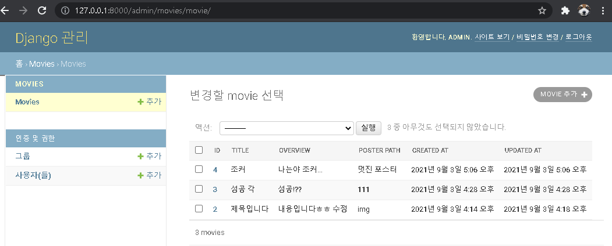
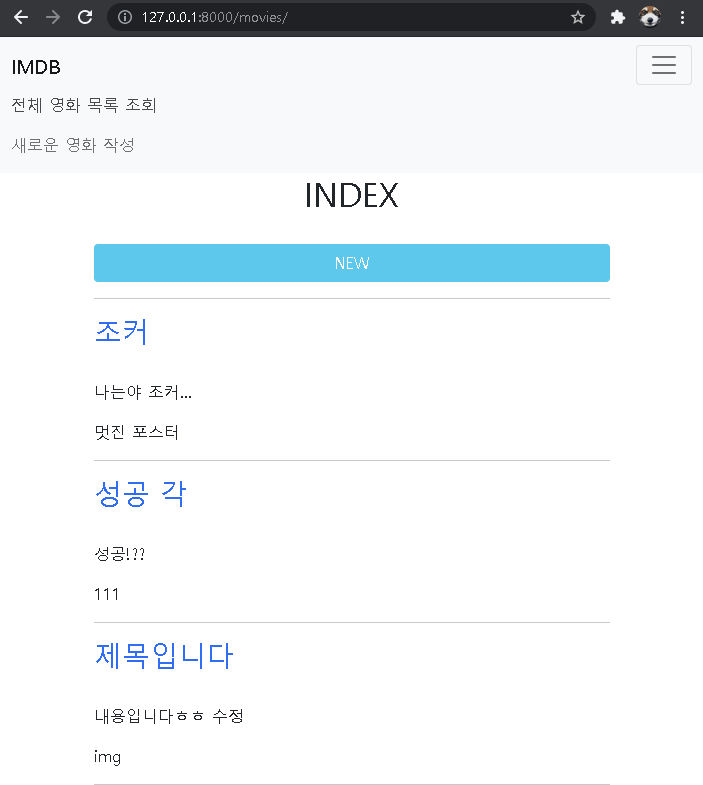
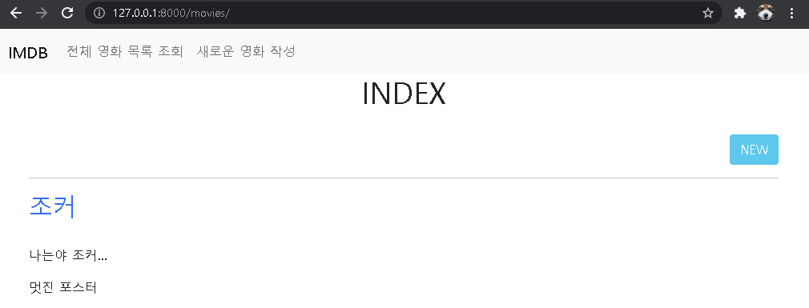
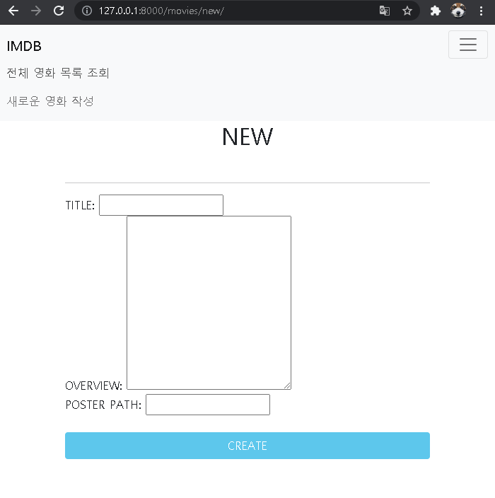
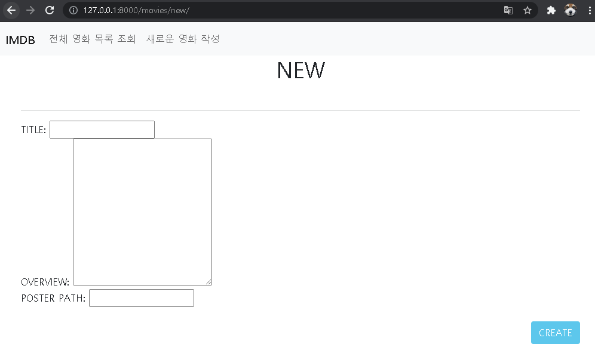
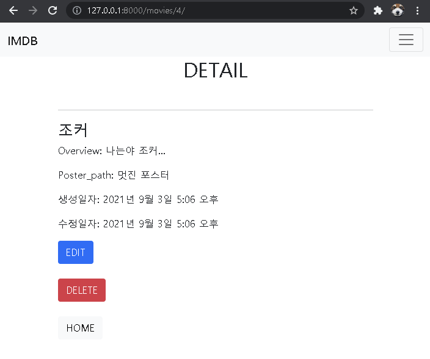
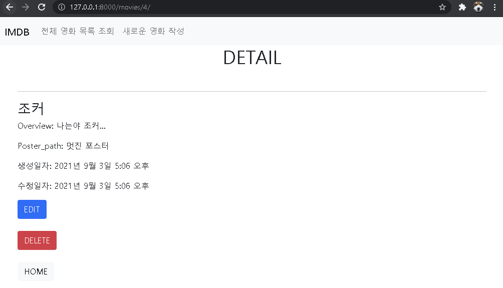
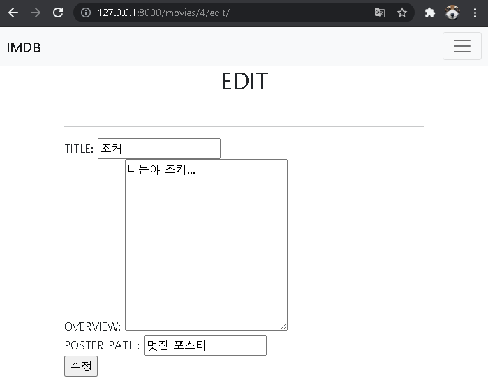

# Django Framework 기반 웹 페이지 구현


### 설치 및 가상환경 설정


1. 새로운 프로젝트 폴더 `pjt04`를 만들고 vscode로 열기
   


2. `venv`라는 이름의 가상환경 생성

   `python -m venv venv`


3. 가상환경 활성화

   `source venv/Scripts/activate`


4. pip 설치 리스트를 확인하여, 새로운 가상환경이 정상적으로 작동 중인지 확인

   `pip list`


5. `django` 설치

   `pip install django`


6. `.gitignore` [내용 복붙](https://www.toptal.com/developers/gitignore/api/python,visualstudiocode,django,venv) 후, 파일 생성


7. 가상환경에 설치한 pip 목록을 `requirements.txt` 파일에 저장 (향후 git hub 등으로 공유 가능)

   `pip freeze > requirements.txt`


8. `pjt04`라는 이름의 프로젝트 생성 (끝에 '.' 을 작성하지 않으면 pjt04/pjt04와 같이 하위폴더에 생성됨)

   `django-admin startproject pjt04 .`


9. Django가 정상적으로 작동하는지 확인 (bash에 뜨는 `http://127.0.0.1:8000/` 클릭, 혹은 주소 입력)

   `python manage.py runserver`


10. 서버가 정상적으로 작동하면 `Ctrl + c`로 서버를 멈춘 후, `movies`라는 이름의 app 생성

    `python manage.py startapp movies`


11. ★중요) `pjt04`폴더의 `settings.py` -> `INSTALLED_APPS`에 movies app추가

    ```python
    INSTALLED_APPS = [
        # local apps
        'movies',
       
        # django apps
        'django.contrib.admin',
        'django.contrib.auth',
        'django.contrib.contenttypes',
        'django.contrib.sessions',
        'django.contrib.messages',
        'django.contrib.staticfiles',
    ]
    ```


12. `settings.py`에서 `LANGUAGE_CODE`를 `ko-kr`로 변경 후 저장, `9` 번으로 서버를 다시 실행하면 한국어로 설정 가능

     `LANGUAGE_CODE = 'ko-kr'`

     `TIME_ZONE = 'Asia/Seoul'`


### URL


- pjt04/urls.py

  ```python
  # pjt04/urls.py
  
  from django.contrib import admin
  from django.urls import path, include   # include import
  
  # http://127.0.0.1:8000/ 뒷부분에 추가로 붙게되는 url
  urlpatterns = [
      path('movies/', include('movies.urls')),    ### http://127.0.0.1:8000/movies/
                                                  # movies/urls.py에 정의된 path들도 포함
      path('admin/', admin.site.urls),            ### http://127.0.0.1:8000/admin/
                                                  # django에서 생성
  ]
  ```

  > 기본주소 `http://127.0.0.1:8000/`에 붙게되는 url 패턴


- movies/urls.py

  ```python
  # movies/urls.py
  
  from django.urls import path
  from . import views     # ./views (즉, movies/views.py)에서 정의한(할) 내용 import
  
  app_name ='movies'
  
  urlpatterns = [
      path('', views.index, name='index'),            # http://127.0.0.1:8000/movies/
      path('new/', views.new, name='new'),            # http://127.0.0.1:8000/movies/new/
      path('create/', views.create, name='create'),
  
      # detail, edit, update, delete는 특정한 pk(id)를 url에 추가
      path('<int:pk>/', views.detail, name='detail'),     # http://127.0.0.1:8000/movies/1/
      path('<int:pk>/edit/', views.edit, name='edit'),    # http://127.0.0.1:8000/movies/1/edit
      path('<int:pk>/update/', views.update, name='update'),
      path('<int:pk>/delete/', views.delete, name='delete'),
  ]
  ```

  >``http://127.0.0.1:8000/movies/`에 붙게되는 url 패턴

  >전체 리스트를 보여주는 index나 새 게시물 작성에는 별도의 primary key가 필요 없지만, detail, edit, update, delete는 특정 pk가 필요하다는 것에 주의


### MODEL


- movies/model.py

  ```python
  from django.db import models
  # movies/models.py
  
  from django.db import models
  
  # Create your models here.
  class Movie(models.Model):
      
      title = models.CharField(max_length=100)
      overview = models.TextField()
      poster_path = models.CharField(max_length=500)
  
      created_at = models.DateTimeField(auto_now_add=True)
      updated_at = models.DateTimeField(auto_now=True)
  
      # 방법1 ) 
      # 1번 영화: 영화제목
      def __str__(self):
          return f'{self.pk}번 영화: {self.title}'
  ```

  > `__str__`을 정의하여 admin페이지 내에서 `Movie object (1)`이 아닌, `1번 영화: 영화제목`으로 확인 가능


### ADMIN


- movies/admin.py

  ```python
  from django.contrib import admin
  from .models import Movie
  
  # Register your models here.
  class MovieAdmin(admin.ModelAdmin):
      list_display = ('id', 'title', 'overview', 'poster_path', 'created_at', 'updated_at')
  
  admin.site.register(Movie, MovieAdmin)
  ```

  > MovieAdmin이라는 클래스를 정의하여 등록하면  admin페이지 내에서 list_display에 있는 내용 확인 가능

  


### INDEX


- movies/views.py

  ```python
  from django.shortcuts import render, redirect
  from .models import Movie
  
  # Create your views here.
  def index(request):
      movies = Movie.objects.order_by('-id')
      context= {
          'movies' : movies
      }
      return render(request, 'movies/index.html', context)
  ```

  > `movies = Movie.objects.all()`이 아닌 `movies = Movie.objects.order_by('-id')`로 작성하면, 새 작성글이 최상단에 오도록 배치됨

  
  

- movies/templates/movies/index.html

  ```django
  
  
  
  <h1 class="text-center">INDEX</h1>
    <br>
    <div class="d-grid gap-2 d-md-flex justify-content-md-end">
      <a href="" class="btn btn-info text-white justify-text-end">NEW</a>
    </div>
    
  
    <hr>
    
      <h2>
         영화제목(movie.title)을 클릭하는 경우, 반복문 속 해당 movie의 pk를 갖는, 이름이 movies인 앱의 detail url로 
        <a href=" " class="text-decoration-none">{{movie.title}}</a>
      </h2>
      <br>
      <p>{{movie.overview}}</p>
      <p>{{movie.poster_path}}</p>
      <hr>
    
  
  
  ```

  > a태그의 href를 통해 가고자 하는 url을 설정할 때는,` movies:detail`과 같이 `app_name:url_name`으로 작성 





​	


### NEW


- movies/views.py

  ```python
  # movies/views.py
  
  # import 및 index 내용 생략
  
  def new(request):
      return render(request, 'movies/new.html')
  
  def create(request):
      title = request.POST.get('title')
      overview = request.POST.get('overview')
      poster_path = request.POST.get('poster_path')
  
      movies = Movie(title=title, overview=overview, poster_path=poster_path)
      movies.save()
  
      return redirect('movies:index')	# render해주는 것이 아니라, movies:index url로 이동
  ```

  > `request.POST.get('title')` : POST 요청 해온 값들 중 'title'에 해당하는 값을 꺼내는 것
  >
  > 파이썬 문법으로는 `request.POST['title']`


- movies/templates/movies/new.html

  ```django
  
  
  
    <h1 class="text-center">NEW</h1>
    <br>
    <hr>
    <form action="" method='POST'>
      
      <label for="title">TITLE: </label>
      <input id="title" type="text" name="title">
      <br>
      
      <label for="overview">OVERVIEW: </label>
      <textarea name="overview" id="overview" cols="30" rows="10"></textarea>
      <br>
      
      <label for="poster_path">POSTER PATH: </label>
      <input id="poster_path" type="text" name="poster_path">
      <br>
      
      <br>
      <div class="d-grid gap-2 d-md-flex justify-content-md-end">
        <input type="submit" class="btn btn-info text-white" value="CREATE">
      </div>
      
    </form>
  
  
  ```

  > `form 태그`를 통해 POST 메소드를 사용하는 경우,  `csrf_token`을 넣어 보안을 유지하는 것에 주의








### DETAIL


- movies/view.py

  ```python
  # movies/views.py
  
  # import 및 index, new, create 내용 생략
  
  def detail(request, pk):
      movie = Movie.objects.get(pk=pk)
      context={
          'movie' : movie
      }
      return render(request, 'movies/detail.html', context)
  ```

  > 특정 pk를 가진 객체에 대해 표현해야하므로, 인자로 request뿐만 아니라 pk도 필요


- movies/templates/movies/detail.html

  ```django
  
  
  
  <h1 class="text-center">DETAIL</h1>
  
  <br>
  <hr>
    <h3>{{ movie.title }}</h3>
    <p>Overview: {{ movie.overview }}</p>
    <p>Poster_path: {{ movie.poster_path }}</p>
    <p>생성일자: {{ movie.created_at }}</p>
    <p>수정일자: {{ movie.updated_at }}</p>
  
    <a href="" class="btn btn-primary">EDIT</a>
    <br>
    <br>
    <form action="" method="POST">
      
      <button class="btn btn-danger">DELETE</button>
    </form>
    <br>
    <a href="" class="btn btn-light">HOME</a>
  
    
  
  ```

  








### EDIT


- movies/views.py

  ```python
  # movies/views.py
  
  # import 및 index, new, create, detail 내용 생략
  
  def edit(request, pk):
      movie = Movie.objects.get(pk=pk)
      context={
          'movie' : movie
      }
      return render(request, 'movies/edit.html', context)
  
  def update(request, pk):
      movie = Movie.objects.get(pk=pk)
      movie.title = request.POST.get('title')
      movie.overview = request.POST.get('overview')
      movie.poster_path = request.POST.get('poster_path')
      movie.save()
      return redirect('movies:detail', movie.pk)
  ```

  > `movies`가 아니라 특정 pk에 대한 단수 `movie`라는 것에 주의


- movies/templates/movies/edit.html

  ```django
  
  
  
    <h1 class="text-center">EDIT</h1>
    <br>
    <hr>
    <form action="" method='POST'>
      
      <label for="title">TITLE: </label>
      <input id="title" type="text" name="title" value="{{ movie.title }}">
      <br>
      
      <label for="overview">OVERVIEW: </label>
      <textarea name="overview" id="overview" cols="30" rows="10">{{ movie.overview }}</textarea>
      <br>
      
      <label for="poster_path">POSTER PATH: </label>
      <input id="poster_path" type="text" name="poster_path" value="{{ movie.poster_path }}">
      <br>
  
      <input type="submit" value="수정">
    </form>
  
  
  ```

  > `input 태그`의 `value`를 통해, 수정 전 기존에 입력된 값을 확인할 수 있다.
  >
  > `textarea`의 경우, value값이 아닌 `열린태그와 닫힘태그 사이`에 기존 입력값을 넣어준다.





### DELETE


- movies/views.py

  ```python
  # movies/views.py
  
  # import 및 index, new, create, detail, edit, update 내용 생략
  
  def delete(request, pk):
      movie = Movie.objects.get(pk=pk)
      if request.method == 'POST':
          movie.delete()
          return redirect('movies:index')
      else:
          return redirect('movie:detail', movie.pk)
  ```

  > `movie.save()`와 반대되는 `movie.delete()` 를 통해 특정 pk에 해당하는 값을 삭제
  >
  > 조건문을 통해 `POST 방식`인 경우에만 삭제 가능하도록 작성

