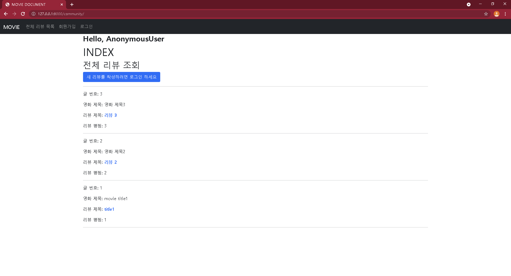
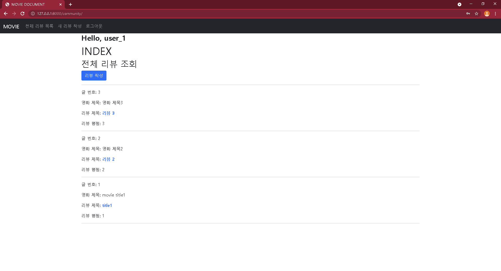
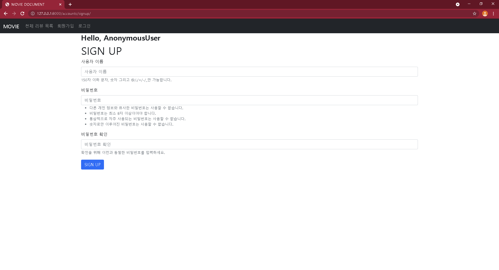
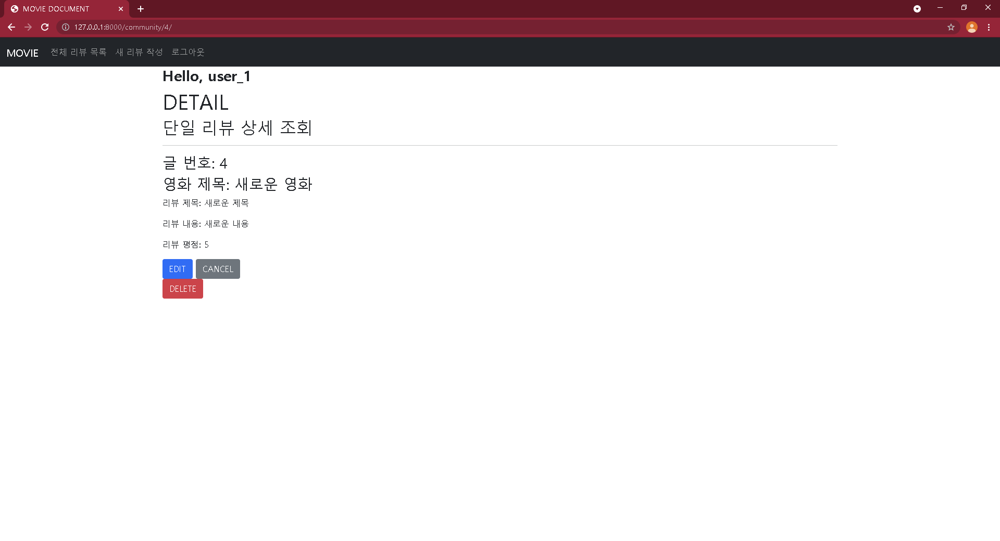
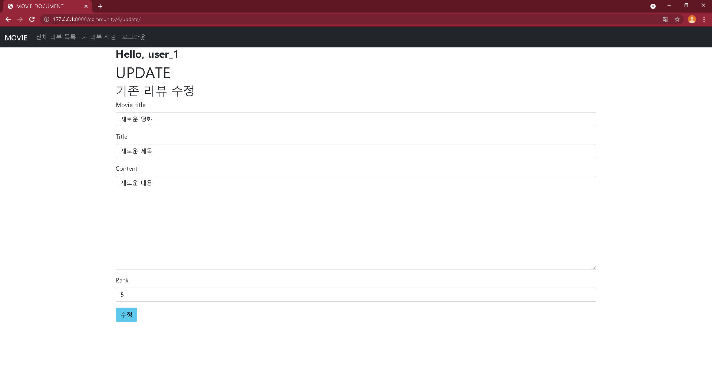
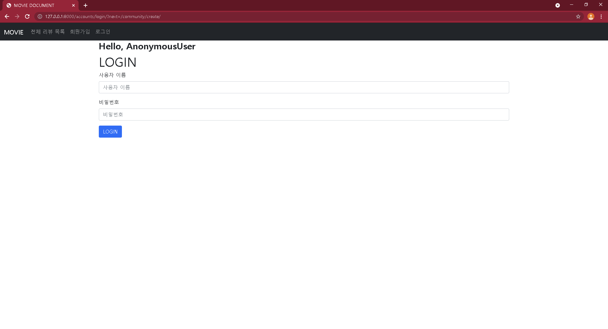
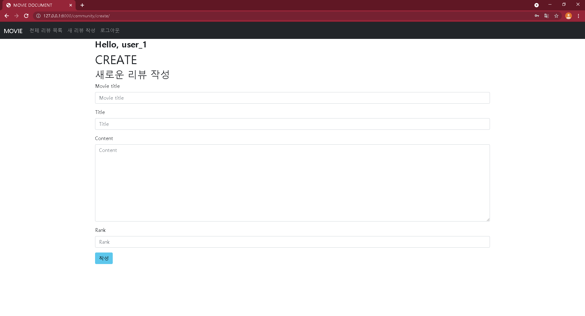

[TOC]


# 1. 느낀 점과 어려움

## 01) 프로젝트

<br>

- 보안을 유지하기 위해 `decorator를 import`하고, crud 및 authentication마다 `알맞는 decorator`를 사용할 수 있도록 각 기능에 대한 이해가 필요할 것 같다.

- navbar의 `로그아웃` nav-link를 만들 때 `a태그`로 GET방식 버튼을 만든 것과는 다르게, POST방식을 사용하기 위해 `form태그`를 사용해야했다. 

  그 과정에서 `button이 생성`되는 것이 `통일성과 미관상` 좋지 않아 이를 해결하는 것에 어려움을 겪었다.	

  `Bootstrap`을 사용하여, 해당 버튼의 `border를 0으로` 설정하고, `bg색상을 navbar와 같은 색`으로 바꿔줌으로써, 사용자의 눈에 거슬리지 않도록 변경할 수 있었다. 

- `base.html`에 navbar 작성 내용을 넣는 것이 아니라, `_navbar.html`로 따로 관리하면 향후 코드 확인에 더 편리할 것 같다.

<br>

## 02) 협업과정

<br>

- 주로 master branch에서 작업하던 것과 달리 새로운 branch로 작성해보니, 원본은 건드리지 않는다는 점이 안심되면서도, 각자 local에서 작성한 내용이 향후 auto merge되지 않는 것에 대한 두려움이 있었다. 하지만 협업하면서 발생하기 쉬운 상황일 수 있으니, 오히려 관통 프로젝트를 통해 시행착오를 겪는 것이 더 바람직한 것 같다.

- 명확하지 않은 부분에 대해 우선 스스로 코드를 작성해본 후 navigator의 피드백이나 설명을 듣게되면, 각 코드의 작동원리에 대해 좀 더 이해할 수 있는 것 같다.

<br>


# 2. 템플릿 외 코드

## 01) SETTINGS

<br>

```python
# pjt06/settings.py

# ...(생략)...

INSTALLED_APPS = [
    'community',
    'accounts',
    'bootstrap5',
    'django.contrib.admin',
    'django.contrib.auth',
    'django.contrib.contenttypes',
    'django.contrib.sessions',
    'django.contrib.messages',
    'django.contrib.staticfiles',
]
```

<br>

```python
# pjt06/settings.py

# ...(생략)...

TEMPLATES = [
    {
        'BACKEND': 'django.template.backends.django.DjangoTemplates',
        'DIRS': [BASE_DIR / 'templates'],
        'APP_DIRS': True,
        'OPTIONS': {
            'context_processors': [
                'django.template.context_processors.debug',
                'django.template.context_processors.request',
                'django.contrib.auth.context_processors.auth',
                'django.contrib.messages.context_processors.messages',
            ],
        },
    },
]
```

<br>

```python
# pjt06/settings.py

# ...(생략)...

LANGUAGE_CODE = 'ko-kr'

TIME_ZONE = 'Asia/Seoul'
```

<br>


## 02) URLS

<br>

### 1. pjt06/urls.py

```python
# pjt06/urls.py

from django.contrib import admin
from django.urls import path, include

urlpatterns = [
    path('admin/', admin.site.urls),
    path('community/', include('community.urls')),
    path('accounts/', include('accounts.urls')),

]
```


<br>

### 2. community/urls.py

```python
# community/urls.py

from django.urls import path, include
from . import views

app_name = 'community'

urlpatterns = [
    path('', views.index, name= 'index'),
    path('create/', views.create, name= 'create'),
    path('<int:review_pk>/', views.detail, name= 'detail'),
    path('<int:review_pk>/update/', views.update, name= 'update'),
    path('<int:review_pk>/delete/', views.delete, name= 'delete'),
]
```

<br>

### 3. accounts/urls.py

```python
# accounts/urls.py

from django.urls import path
from . import views

app_name = 'accounts'

urlpatterns = [
    path('login/', views.login, name= 'login'),
    path('logout/', views.logout, name= 'logout'),
    path('signup/', views.signup, name= 'signup'),
]
```

<br>


## 03) MODELS

<br>

```python
# community/models.py

from django.db import models

# Create your models here.
class Review(models.Model):
    movie_title = models.CharField(max_length=100)
    title = models.CharField(max_length=100)
    content = models.TextField()
    rank = models.IntegerField()

    created_at = models.DateTimeField(auto_now_add=True)
    updated_at = models.DateTimeField(auto_now=True)

    def __str__(self):
        return self.movie_title
```

<br>

## 04) FORMS

<br>

```python
# community/forms.py

from django import forms
from .models import Review

class ReviewForm(forms.ModelForm):
    class Meta:
        model = Review
        fields = '__all__'
```

<br>

## 05) VIEWS

<br>

### 1. community/views.py

```python
# community/views.py

from django.contrib.auth import login
from django.contrib.auth.decorators import login_required
from django.shortcuts import render, redirect, get_object_or_404
from .forms import ReviewForm
from .models import Review
from django.views.decorators.http import require_safe, require_POST, require_http_methods
from django.contrib import messages

# Create your views here.

@require_safe
def index(request):
    reviews = Review.objects.order_by('-pk')    
    # reviews = Review.objects.all()    
    context ={
        'reviews': reviews
    }
    return render(request, 'community/index.html', context)

@login_required
@require_http_methods(['GET', 'POST'])
def create(request):
    if request.method == 'POST':
        form = ReviewForm(request.POST)
        if form.is_valid:
            review = form.save()
            messages.info(request, '리뷰가 작성되었습니다.')
            return redirect('community:detail', review.pk)
    else:
        form = ReviewForm()
    context= {
        'form': form,
    }
    return render(request, 'community/form.html', context)

@require_safe
def detail(request, review_pk):
    review = get_object_or_404(Review, pk=review_pk)
    context= {
        'review': review,
    }
    return render(request, 'community/detail.html', context)

@require_http_methods(['GET', 'POST'])
def update(request, review_pk):
    review = get_object_or_404(Review, pk=review_pk)
    if request.method == 'POST':
        form = ReviewForm(request.POST, instance=review)
        if form.is_valid:
            review = form.save()
            messages.info(request, '리뷰가 수정되었습니다.')
            return redirect('community:detail', review.pk)
    else:
        form = ReviewForm(instance=review)
    context= {
        'form': form,
        'review': review,
    }
    return render(request, 'community/update.html', context)

@ require_POST
def delete(request, review_pk):
    review = get_object_or_404(Review, pk=review_pk)
    review.delete()
    return redirect('community:index')
```

<br>

### 2. accounts/views.py

```python
# accounts/views.py

from django.shortcuts import render, redirect, get_object_or_404
from django.views.decorators.http import require_safe, require_POST, require_http_methods
from django.contrib import messages
from django.contrib.auth.forms import AuthenticationForm, UserCreationForm
from django.contrib.auth import login as auth_login
from django.contrib.auth import logout as auth_logout
from django.contrib.auth.decorators import login_required

# Create your views here.
@require_http_methods(['GET', 'POST'])
def login(request):
    if request.user.is_authenticated:
        return redirect('community:index')
    if request.method == "POST":
        form = AuthenticationForm(request, request.POST)
        if form.is_valid():
            auth_login(request, form.get_user())
            return redirect(request.GET.get('next') or 'community:index')
    else:
        form = AuthenticationForm()
    context = {
        'form': form
    }
    return render(request, 'accounts/login.html', context)

@require_POST
def logout(request):
    auth_logout(request)
    return redirect('community:index')

@require_http_methods(['GET', 'POST'])
def signup(request):
    if request.user.is_authenticated:
        return redirect('community:index')
    if request.method == 'POST':
        form = UserCreationForm(request.POST)
        if form.is_valid():
            user = form.save()
            auth_login(request, user)
            return redirect('community:index')
    else:
        form = UserCreationForm()
    context={
        'form': form,
    }
    return render(request, 'accounts/signup.html', context)
```

<br>


## 06) ADMIN

<br>

```python
# community/admin.py

from django.contrib import admin
from .models import Review

# Register your models here.
admin.site.register(Review)
```

<br>

## 07) BASE TEMPLATE

<br>

### 1. templates/base.html

```django
<!-- templates/base.html -->



<!DOCTYPE html>
<html lang="en">
<head>
  <meta charset="UTF-8">
  <meta http-equiv="X-UA-Compatible" content="IE=edge">
  <meta name="viewport" content="width=device-width, initial-scale=1.0">
  <title>MOVIE DOCUMENT</title>
  
  
</head>
<body>
  

  <div class="container">
    <h3 class="fw-bold">Hello, {{ user }} </h3>
    
    
    
  </div>
  
</body>
</html>
```

<br>

### 2. templates/_navbar.html

```django
<nav class="navbar navbar-expand-lg navbar-dark bg-dark">
  <div class="container-fluid">
    <a class="navbar-brand" href="">MOVIE</a>
    <button class="navbar-toggler" type="button" data-bs-toggle="collapse" data-bs-target="#navbarNavDropdown" aria-controls="navbarNavDropdown" aria-expanded="false" aria-label="Toggle navigation">
      <span class="navbar-toggler-icon"></span>
    </button>
    <div class="collapse navbar-collapse" id="navbarNavDropdown">
      <ul class="navbar-nav">
        <li class="nav-item">
          <a class="nav-link" aria-current="page" href="">전체 리뷰 목록</a>
        </li>

        
          <li class="nav-item">
           <a class="nav-link" href="">새 리뷰 작성</a>
          </li>
          <li class="nav-item">
            <a class="nav-link" href="">로그아웃</a> 
           <form action="" method="POST">
            
             <link class="nav-link">로그아웃</link> 
            <input type="submit" value="로그아웃" class="nav-link border-0 bg-dark" >
             <a class="nav-link" href="">로그아웃</a> 
           </form>
          </li>
        
          <li class="nav-item">
           <a class="nav-link" href="">회원가입</a>
          </li>
          <li class="nav-item">
            <a class="nav-link" href="">로그인</a>
          </li>
        
      </ul>
    </div>
  </div>
</nav>
```


# 3. 결과물

<br>

## 01) /community/


### 1-1. (로그인 없이) `/community/`

- `base.html`에 작성된 내용을 통해, 모든 페이지에서 상단 nav bar의 `MOVIE`, 또는, `전체 리뷰 목록`을 누르면 해당 페이지로 이동
- 아직 login 상태가 아니므로, 상단 `navbar`에 `회원가입, 로그인`이 나타나도록 구현
- `리뷰 제목` 클릭 시, 해당 게시글의 `단일 상세 페이지`로 진입
- 이미 회원가입을 통한 계정이 있는 경우로, `새 리뷰를 작성하려면 로그인 하세요`버튼을 통해 `login -> create` 가능


<br>



<br>


### 1-2. (LOG IN 상태) `/community/` 

- 성공적으로 signup을 마친 경우, 해당 id로 로그인 된 상태로 index 페이지로 redirect
- `login상태`이므로, nav bar에 `회원가입, 로그인`대신,  `새 리뷰 작성, 로그아웃`이 나타나도록 구현

<br>




```django
<!-- community/templates/community/index.html -->





  <h1>INDEX</h1>
  <h2>전체 리뷰 조회</h2>
  
    <a href="" class="btn btn-primary">리뷰 작성</a>
  
    <a href="" class="btn btn-primary">새 리뷰를 작성하려면 로그인 하세요</a>
  
  
  <hr>
  
  
    <p>글 번호: {{ review.pk }}</p>
    <p>영화 제목: {{ review.movie_title }}</p>
    <p>리뷰 제목: <a href="" class="fw-bold text-primary text-decoration-none">{{review.title}}</a>
    </p>
    <p>리뷰 평점: {{review.rank}}</p>
    <hr>
  
  


```


<br>

## 02) (로그인 없이) `/accounts/signup/`

- 상단 `navbar의 회원가입`을 클릭하면 나타나도록 구현
- signup페이지에 `POST method`로 request하면, 새로운 계정 생성

<br>





<br>

```django
<!-- accounts/templates/accounts/signup.html -->





<h1>SIGN UP</h1>
  <form action="" method="POST">
  
  
  <input type="submit" class="btn btn-primary" value="SIGN UP">
  </form>


```

<br>


## 03) (LOG IN 상태) `/community/create/`

- index 페이지의 `리뷰 작성` 버튼, 또는, `navbar의 새 리뷰 작성`을 클릭하면 나타나도록 구현

<br>


<br>


```django
<!-- community/templates/community/form.html -->





  <h1>CREATE</h1>
  <h2>새로운 리뷰 작성</h2>
  
  <form action="" method="POST">
    
     {{ form.as_p }} 
    
    <button class="btn btn-info">작성</button>
  </form>
  

```

<br>


## 04) (LOG IN 상태) `/community/<int:review_pk>/`

- 새로 작성한 리뷰 게시글에 대한 단일 상세 페이지(DETAIL)
- `EDIT 버튼으로 update페이지`, `CANCEL 버튼으로 index 페이지`로 갈 수 있으며, `DELETE 버튼`의 경우 `form 태그`의 `POST method`로 리뷰 삭제 가능

<br>




<br>

```django
<!-- community/templates/community/detail.html -->





  <h1>DETAIL</h1>
  <h2>단일 리뷰 상세 조회</h2>
  <hr>
  
  <h3>글 번호: {{ review.pk }}</h3>
  <h3>영화 제목: {{ review.movie_title }}</h3>
  <p>리뷰 제목: {{review.title}}</p>
  <p>리뷰 내용: {{review.content}}</p>
  <p>리뷰 평점: {{review.rank}}</p>

  <a href="" class="btn btn-primary">EDIT</a>
  <a href="" class="btn btn-secondary">CANCEL</a>
  <form action="" method="POST">
    
    <button class="btn btn-danger">DELETE</button>  
  </form>


```

<br>


## 05) (LOG IN 상태) `/community/<int:review_pk>/update/`

- create로 생성했던 내용을 instance로 사용하여, 기존 내용을 불러와 수정할 수 있도록 구현 
- 수정 완료 후, pk를 통해 detail 페이지로 redirect 하도록 구현

<br>




<br>

```django
<!-- community/templates/community/update.html -->





  <h1>UPDATE</h1>
  <h2>기존 리뷰 수정</h2>
  
  <form action="" method="POST">
    
     {{ form.as_p }} 
    
    <button class="btn btn-info">수정</button>
  </form>
  

```

<br>


## 06) (로그아웃 이후) `/accounts/login/?next=/community/create/`

- 가입된 계정이 있으며, 리뷰를 작성하기 위해 로그인만 필요한 경우로, `로그인 이후 create 페이지`로

<br>






<br>


```django
<!-- accounts/template/accounts/login.html -->





  <h1>LOGIN</h1>
  <form action="", method="POST">
    
   {{ form.as_p }} 
    
    <input class="btn btn-primary" type="submit" value="LOGIN">
  </form>

```

<br>

